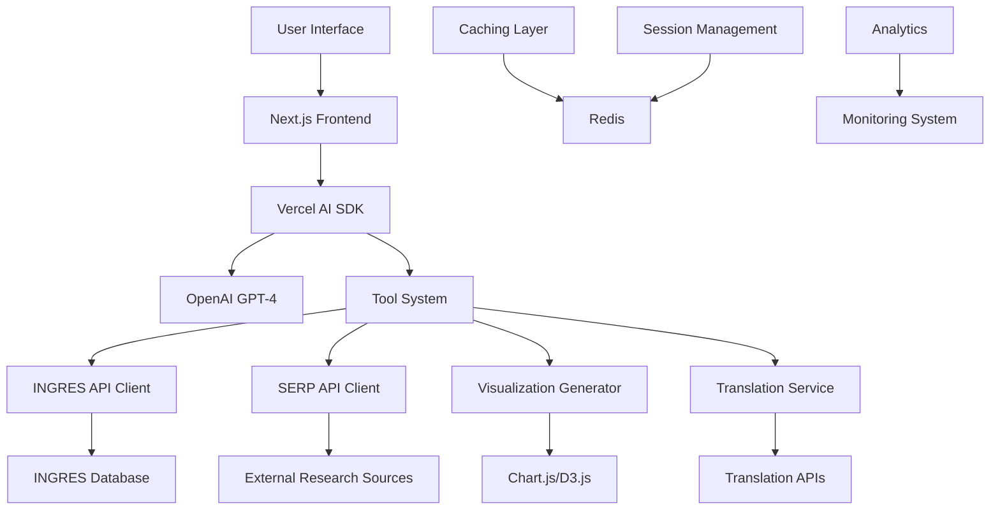

# Design Document

## Overview

The INGRES Groundwater AI Chatbot design transforms the existing stock market chatbot into a specialized groundwater data assistant. The system leverages the current Next.js architecture with Vercel AI SDK, maintaining the proven patterns while adapting data sources, UI components, and conversation flows for groundwater domain expertise.

The design follows a modular architecture where the existing SERP API integration is repurposed for groundwater research, the generative UI components are adapted for groundwater visualizations, and new domain-specific tools are added for INGRES database integration.

## Architecture

### High-Level System Architecture



### Technology Stack

**Frontend Framework:**
- Next.js 14.2.5 with App Router (existing)
- TypeScript for type safety (existing)
- Tailwind CSS for styling (existing)
- Framer Motion for animations (existing)

**AI Integration:**
- Vercel AI SDK 3.3.20 (existing)
- OpenAI GPT-4 with custom system prompts
- Streaming UI with React Server Components

**Data Visualization:**
- Recharts 2.15.2 (existing) for charts
- D3.js integration for advanced maps
- Custom React components for groundwater-specific visualizations

**External Integrations:**
- SERP API (existing) - repurposed for groundwater research
- INGRES API - new integration for official data
- Translation APIs for multilingual support

## Components and Interfaces

### Core Data Models

```typescript
// Groundwater Assessment Data Models
interface GroundwaterAssessment {
  region: {
    state: string;
    district: string;
    block?: string;
    mandal?: string;
    taluk?: string;
  };
  assessmentYear: number;
  recharge: {
    annual: number; // in MCM (Million Cubic Meters)
    monsoon: number;
    nonMonsoon: number;
  };
  extraction: {
    total: number; // in MCM
    irrigation: number;
    domestic: number;
    industrial: number;
  };
  stage: number; // percentage (extraction/recharge * 100)
  category: 'Safe' | 'Semi-Critical' | 'Critical' | 'Over-Exploited';
  trend: 'Improving' | 'Stable' | 'Deteriorating';
}

interface RegionalComparison {
  regions: GroundwaterAssessment[];
  comparisonType: 'state' | 'district' | 'block';
  timeRange: {
    startYear: number;
    endYear: number;
  };
}

interface TrendAnalysis {
  region: string;
  historicalData: GroundwaterAssessment[];
  projections?: {
    year: number;
    predictedStage: number;
    confidence: number;
  }[];
}
```

### API Integration Layer

```typescript
// INGRES API Client
class INGRESApiClient {
  private baseUrl = 'https://ingres.iith.ac.in/api';
  
  async getAssessmentData(
    region: string, 
    year: number
  ): Promise<GroundwaterAssessment> {
    // Implementation for INGRES API calls
  }
  
  async getHistoricalTrends(
    region: string, 
    years: number[]
  ): Promise<TrendAnalysis> {
    // Implementation for historical data retrieval
  }
  
  async searchRegions(query: string): Promise<RegionInfo[]> {
    // Implementation for region search
  }
}

// Enhanced SERP API Client for Groundwater Research
class GroundwaterResearchClient {
  async searchGroundwaterResearch(
    topic: string, 
    region?: string
  ): Promise<ResearchData[]> {
    const query = `groundwater ${topic} ${region || 'India'} CGWB research`;
    // Repurpose existing SERP API integration
  }
  
  async getLatestPolicyUpdates(): Promise<PolicyUpdate[]> {
    // Search for recent groundwater policy changes
  }
}
```

### Generative UI Components

```typescript
// Groundwater Status Map Component
interface GroundwaterMapProps {
  data: GroundwaterAssessment[];
  level: 'state' | 'district' | 'block';
  interactive: boolean;
}

// Trend Analysis Chart Component
interface TrendChartProps {
  data: TrendAnalysis;
  showProjections: boolean;
  timeRange: [number, number];
}

// Regional Comparison Dashboard
interface ComparisonDashboardProps {
  regions: RegionalComparison;
  metrics: ('recharge' | 'extraction' | 'stage')[];
}

// Category Distribution Pie Chart
interface CategoryDistributionProps {
  data: {
    category: string;
    count: number;
    percentage: number;
  }[];
  region: string;
}
```

### Tool System Architecture

```typescript
// Enhanced Tool System for Groundwater Domain
const groundwaterTools = {
  getGroundwaterStatus: {
    description: "Get current groundwater status for a specific region",
    parameters: z.object({
      region: z.string(),
      level: z.enum(['state', 'district', 'block']),
      year: z.number().optional()
    }),
    generate: async function* ({ region, level, year }) {
      // Implementation for groundwater status retrieval
    }
  },
  
  generateTrendAnalysis: {
    description: "Generate trend analysis with visualizations",
    parameters: z.object({
      region: z.string(),
      timeRange: z.object({
        start: z.number(),
        end: z.number()
      }),
      includeProjections: z.boolean().optional()
    }),
    generate: async function* ({ region, timeRange, includeProjections }) {
      // Implementation for trend analysis
    }
  },
  
  searchGroundwaterResearch: {
    description: "Search latest groundwater research and publications",
    parameters: z.object({
      topic: z.string(),
      region: z.string().optional(),
      timeframe: z.enum(['recent', 'year', 'all']).optional()
    }),
    generate: async function* ({ topic, region, timeframe }) {
      // Implementation for research search
    }
  },
  
  compareRegions: {
    description: "Compare groundwater status between multiple regions",
    parameters: z.object({
      regions: z.array(z.string()),
      metrics: z.array(z.enum(['recharge', 'extraction', 'stage', 'category'])),
      year: z.number().optional()
    }),
    generate: async function* ({ regions, metrics, year }) {
      // Implementation for regional comparison
    }
  }
};
```

## Data Models

### Database Schema Design

```sql
-- Groundwater Assessment Data
CREATE TABLE groundwater_assessments (
  id SERIAL PRIMARY KEY,
  state VARCHAR(100) NOT NULL,
  district VARCHAR(100) NOT NULL,
  block VARCHAR(100),
  assessment_year INTEGER NOT NULL,
  annual_recharge DECIMAL(10,2),
  monsoon_recharge DECIMAL(10,2),
  non_monsoon_recharge DECIMAL(10,2),
  total_extraction DECIMAL(10,2),
  irrigation_extraction DECIMAL(10,2),
  domestic_extraction DECIMAL(10,2),
  industrial_extraction DECIMAL(10,2),
  stage_percentage DECIMAL(5,2),
  category VARCHAR(20),
  trend VARCHAR(20),
  created_at TIMESTAMP DEFAULT CURRENT_TIMESTAMP,
  updated_at TIMESTAMP DEFAULT CURRENT_TIMESTAMP
);

-- Regional Metadata
CREATE TABLE regions (
  id SERIAL PRIMARY KEY,
  state VARCHAR(100) NOT NULL,
  district VARCHAR(100),
  block VARCHAR(100),
  latitude DECIMAL(10,8),
  longitude DECIMAL(11,8),
  area_sqkm DECIMAL(10,2),
  population INTEGER,
  created_at TIMESTAMP DEFAULT CURRENT_TIMESTAMP
);

-- Research Cache
CREATE TABLE research_cache (
  id SERIAL PRIMARY KEY,
  query_hash VARCHAR(64) UNIQUE,
  query_text TEXT,
  results JSONB,
  source VARCHAR(50),
  cached_at TIMESTAMP DEFAULT CURRENT_TIMESTAMP,
  expires_at TIMESTAMP
);
```

### Caching Strategy

```typescript
interface CacheConfig {
  assessmentData: {
    ttl: 24 * 60 * 60; // 24 hours
    key: (region: string, year: number) => string;
  };
  researchData: {
    ttl: 6 * 60 * 60; // 6 hours
    key: (query: string) => string;
  };
  visualizations: {
    ttl: 12 * 60 * 60; // 12 hours
    key: (type: string, params: object) => string;
  };
}
```

## Error Handling

### Error Classification and Response Strategy

```typescript
enum GroundwaterErrorType {
  DATA_NOT_FOUND = 'DATA_NOT_FOUND',
  API_RATE_LIMIT = 'API_RATE_LIMIT',
  INVALID_REGION = 'INVALID_REGION',
  TRANSLATION_FAILED = 'TRANSLATION_FAILED',
  VISUALIZATION_ERROR = 'VISUALIZATION_ERROR'
}

class GroundwaterErrorHandler {
  static handleError(error: GroundwaterErrorType, context: any): ReactNode {
    switch (error) {
      case GroundwaterErrorType.DATA_NOT_FOUND:
        return <DataNotFoundComponent region={context.region} />;
      case GroundwaterErrorType.INVALID_REGION:
        return <RegionSuggestionComponent query={context.query} />;
      case GroundwaterErrorType.API_RATE_LIMIT:
        return <RateLimitComponent retryAfter={context.retryAfter} />;
      default:
        return <GenericErrorComponent />;
    }
  }
}
```

### Graceful Degradation

```typescript
interface FallbackStrategy {
  primarySource: 'INGRES_API';
  fallbackSources: ['CACHED_DATA', 'SERP_RESEARCH', 'STATIC_DATA'];
  degradationLevels: {
    full: 'All features available';
    limited: 'Basic data with cached visualizations';
    minimal: 'Text-only responses with external links';
  };
}
```

## Testing Strategy

### Unit Testing Approach

```typescript
// API Integration Tests
describe('INGRESApiClient', () => {
  test('should fetch assessment data for valid region', async () => {
    const client = new INGRESApiClient();
    const data = await client.getAssessmentData('Punjab', 2024);
    expect(data).toHaveProperty('stage');
    expect(data.category).toBeOneOf(['Safe', 'Semi-Critical', 'Critical', 'Over-Exploited']);
  });
});

// Tool Function Tests
describe('Groundwater Tools', () => {
  test('should generate trend analysis with correct data structure', async () => {
    const result = await groundwaterTools.generateTrendAnalysis.generate({
      region: 'Tamil Nadu',
      timeRange: { start: 2019, end: 2024 },
      includeProjections: true
    });
    expect(result).toContainVisualization();
  });
});
```

### Integration Testing

```typescript
// End-to-End Conversation Flow Tests
describe('Groundwater Chatbot Integration', () => {
  test('should handle multilingual groundwater status query', async () => {
    const response = await sendMessage('पंजाब में भूजल की स्थिति क्या है?');
    expect(response).toContainGroundwaterData();
    expect(response).toBeInLanguage('hindi');
  });
  
  test('should generate interactive visualizations for trend queries', async () => {
    const response = await sendMessage('Show me groundwater trends in Karnataka over last 5 years');
    expect(response).toContainComponent('TrendChart');
    expect(response).toContainComponent('RegionalMap');
  });
});
```

### Performance Testing

```typescript
interface PerformanceMetrics {
  responseTime: {
    target: '<3 seconds';
    measurement: 'Time from query to first meaningful response';
  };
  concurrentUsers: {
    target: '1000+ users';
    measurement: 'Simultaneous active conversations';
  };
  dataFreshness: {
    target: '<24 hours for assessment data';
    measurement: 'Time since last data sync with INGRES';
  };
}
```

## Multilingual Implementation

### Translation Architecture

```typescript
interface TranslationService {
  supportedLanguages: [
    'en', 'hi', 'ta', 'te', 'bn', 'mr', 'gu', 'kn', 'ml', 'pa', 'as', 'or'
  ];
  
  translateResponse(
    text: string, 
    targetLanguage: string, 
    preserveTerms: string[]
  ): Promise<string>;
  
  getLocalizedTerminology(
    term: string, 
    language: string
  ): Promise<string>;
}

// Technical Term Preservation
const groundwaterTerminology = {
  'en': {
    'recharge': 'recharge',
    'extraction': 'extraction',
    'stage': 'stage of groundwater development'
  },
  'hi': {
    'recharge': 'भूजल पुनर्भरण',
    'extraction': 'भूजल निकासी',
    'stage': 'भूजल विकास चरण'
  }
  // Additional languages...
};
```

### Cultural Adaptation

```typescript
interface RegionalContext {
  culturalAdaptations: {
    'punjab': {
      emphasis: ['irrigation', 'agriculture'];
      localTerms: ['tubewell', 'kharif', 'rabi'];
    };
    'rajasthan': {
      emphasis: ['water_scarcity', 'conservation'];
      localTerms: ['bawdi', 'johad', 'tanka'];
    };
  };
}
```

## Security and Compliance

### Data Protection Strategy

```typescript
interface SecurityMeasures {
  apiAuthentication: {
    method: 'JWT_TOKENS';
    rotation: '24_HOURS';
    encryption: 'AES_256';
  };
  
  dataAnonymization: {
    personalData: 'REMOVE_PII';
    locationData: 'AGGREGATE_ONLY';
    queryLogs: 'HASH_SENSITIVE_TERMS';
  };
  
  rateLimiting: {
    perUser: '100_requests_per_hour';
    perIP: '500_requests_per_hour';
    serpAPI: '1000_requests_per_day';
  };
}
```

### Audit and Compliance

```typescript
interface AuditSystem {
  queryLogging: {
    logLevel: 'INFO';
    retention: '90_DAYS';
    fields: ['timestamp', 'query_hash', 'response_type', 'user_region'];
  };
  
  complianceChecks: {
    dataRetention: 'GOVERNMENT_POLICY_COMPLIANT';
    accessControl: 'ROLE_BASED';
    dataExport: 'CONTROLLED_ACCESS';
  };
}
```

## Performance Optimization

### Caching Strategy

```typescript
interface CachingLayers {
  l1_memory: {
    type: 'In-Memory';
    ttl: '5_MINUTES';
    size: '100MB';
    content: 'Frequent_Queries';
  };
  
  l2_redis: {
    type: 'Redis';
    ttl: '1_HOUR';
    size: '1GB';
    content: 'Assessment_Data';
  };
  
  l3_database: {
    type: 'PostgreSQL';
    ttl: 'PERSISTENT';
    content: 'Historical_Data';
  };
}
```

### Progressive Loading

```typescript
interface LoadingStrategy {
  initialResponse: {
    timeTarget: '<1_SECOND';
    content: 'Basic_Text_Response';
  };
  
  enhancedResponse: {
    timeTarget: '<3_SECONDS';
    content: 'With_Visualizations';
  };
  
  fullResponse: {
    timeTarget: '<5_SECONDS';
    content: 'Complete_Analysis';
  };
}
```

This design maintains the proven architecture of the existing stock chatbot while adapting it comprehensively for groundwater domain expertise. The modular approach allows for incremental implementation and testing of each component while ensuring scalability and maintainability.